# GameProperty System - Diagram Collection

**适用EasyPack版本：** EasyPack v1.6.0
**最后更新：** 2025-10-31

---

## 概述

本文档提供 GameProperty System 的可视化架构图和数据流图，帮助开发者快速理解系统设计和运作机制。

---

## 目录

- [概述](#概述)
- [核心类图](#核心类图)
  - [GameProperty 核心类图](#gameproperty-核心类图)
  - [组合属性类图](#组合属性类图)
  - [管理器类图](#管理器类图)
- [数据流程图](#数据流程图)
  - [属性值计算流程](#属性值计算流程)
  - [依赖关系建立与更新流程](#依赖关系建立与更新流程)
- [序列图](#序列图)
  - [创建并修改属性的完整流程](#创建并修改属性的完整流程)
  - [事件系统交互流程](#事件系统交互流程)
  - [依赖关系建立与传播流程](#依赖关系建立与传播流程)
- [状态图](#状态图)
  - [GameProperty 状态转换](#gameproperty-状态转换)
  - [CombineGameProperty 生命周期状态](#combinegameproperty-生命周期状态)
- [性能优化相关](#性能优化相关)
- [相关资源](#相关资源)

---

## 核心类图

### GameProperty 核心类图

展示 GameProperty 系统的核心类及其关系。

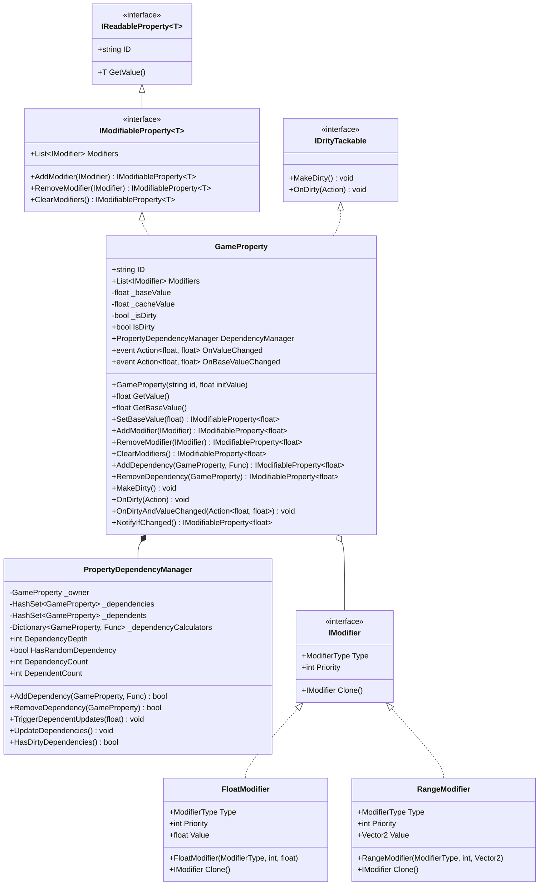

**说明：**
- `GameProperty` 是核心类，实现了 `IModifiableProperty<float>` 和 `IDrityTackable` 接口
- `PropertyDependencyManager` 负责管理属性间的依赖关系，与 `GameProperty` 是组合关系
- `IModifier` 是修饰符接口，`FloatModifier` 和 `RangeModifier` 是具体实现
- 使用泛型接口设计，支持扩展到其他类型（如 `int`、`bool`）

---

### 组合属性类图

展示组合属性的继承层次和结构。

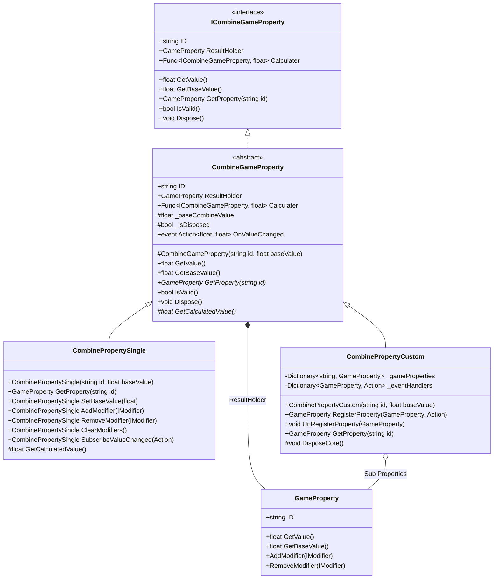

**说明：**
- `ICombineGameProperty` 是组合属性接口，定义了统一的访问方式
- `CombineGameProperty` 是抽象基类，提供通用实现
- `CombinePropertySingle` 包装单一 `GameProperty`，适用于简单场景
- `CombinePropertyCustom` 支持多个子属性和自定义计算逻辑，适用于复杂场景
- 所有组合属性都包含 `ResultHolder`（`GameProperty`），用于存储计算结果并应用修饰符

---

### 管理器类图

展示 GamePropertyManager 的结构和管理机制。

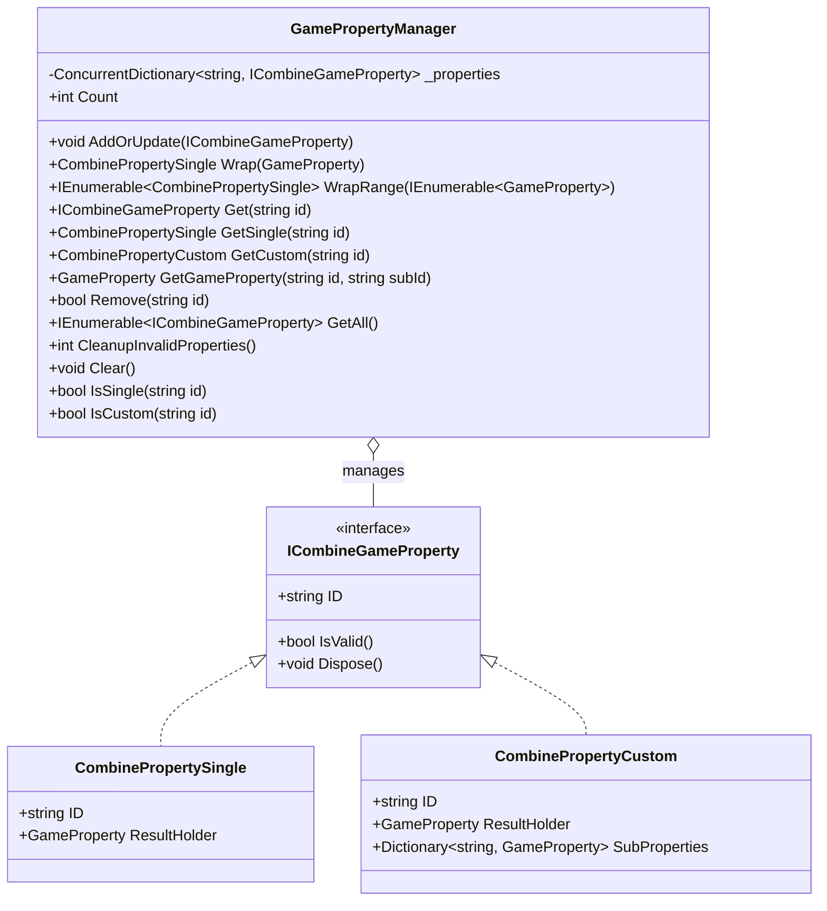

**说明：**
- `GamePropertyManager` 使用线程安全的 `ConcurrentDictionary` 存储属性
- 支持添加、查询、删除、清理等操作
- 提供 `Wrap()` 方法将普通 `GameProperty` 自动包装为 `CombinePropertySingle`
- 管理器负责属性的生命周期，包括自动释放资源

---

## 数据流程图

### 属性值计算流程

展示 `GetValue()` 方法的计算流程和优化机制。

```mermaid
flowchart TD
    Start([调用 GetValue]) --> CheckRecalc{需要重新计算?}
    
    Note1[检查条件:<br/>1. 有非Clamp的RangeModifier<br/>2. 有随机依赖<br/>3. _isDirty为true<br/>4. 依赖项中有脏数据]
    
    CheckRecalc -->|否| ReturnCache[返回缓存值]
    CheckRecalc -->|是| HasDependencies{有依赖项?}
    HasDependencies -->|是| UpdateDependencies[更新所有依赖属性<br/>调用 UpdateDependencies]
    HasDependencies -->|否| GetBaseValue[获取基础值]
    UpdateDependencies --> GetBaseValue
    GetBaseValue --> ApplyModifiers[按顺序应用修饰符]
    
    ApplyModifiers --> Override{有 Override 修饰符?}
    Override -->|是| ApplyOverride[应用覆盖值]
    Override -->|否| PriorityAdd{有 PriorityAdd?}
    
    ApplyOverride --> PriorityAdd
    
    ApplyModifiers --> Override{有 Override 修饰符?}
    Override -->|是| ApplyOverride[应用覆盖值]
    Override -->|否| PriorityAdd{有 PriorityAdd?}
    
    ApplyOverride --> PriorityAdd
    PriorityAdd -->|是| ApplyPriorityAdd[应用优先级加法]
    PriorityAdd -->|否| Add{有 Add?}
    
    ApplyPriorityAdd --> Add
    Add -->|是| ApplyAdd[应用普通加法]
    Add -->|否| PriorityMul{有 PriorityMul?}
    
    ApplyAdd --> PriorityMul
    PriorityMul -->|是| ApplyPriorityMul[应用优先级乘法]
    PriorityMul -->|否| Mul{有 Mul?}
    
    ApplyPriorityMul --> Mul
    Mul -->|是| ApplyMul[应用普通乘法]
    Mul -->|否| AfterAdd{有 AfterAdd?}
    
    ApplyMul --> AfterAdd
    AfterAdd -->|是| ApplyAfterAdd[应用后加法]
    AfterAdd -->|否| Clamp{有 Clamp?}
    
    ApplyAfterAdd --> Clamp
    Clamp -->|是| ApplyClamp[应用范围限制]
    Clamp -->|否| CacheResult[缓存计算结果]
    
    ApplyClamp --> CacheResult
    CacheResult --> ClearDirtyFlag{无随机性?}
    ClearDirtyFlag -->|是| ClearDirty[清除脏标记]
    ClearDirtyFlag -->|否| KeepDirty[保持脏标记]
    
    ClearDirty --> CheckChange{值是否变化?}
    KeepDirty --> CheckChange
    CheckChange -->|是| TriggerEvent[触发 OnValueChanged 事件]
    CheckChange -->|否| ReturnResult[返回最终值]
    
    TriggerEvent --> UpdateDependents[触发依赖者更新]
    UpdateDependents --> ReturnResult
    
    ReturnCache --> End([结束])
    ReturnResult --> End

    style Start fill:#e1f5ff
    style End fill:#e1f5ff
    style CheckRecalc fill:#fff4e1
    style CheckChange fill:#fff4e1
    style ReturnCache fill:#e8f5e9
    style ReturnResult fill:#e8f5e9
    style Note1 fill:#fffacd
```

**说明：**
- **脏标记机制**：检查三个条件（非Clamp随机修饰符、随机依赖、自身脏）
- **主动传播**：属性变脏时主动传播脏标记到所有依赖者
- **修饰符执行顺序**：Override → PriorityAdd → Add → PriorityMul → Mul → AfterAdd → Clamp
- **事件触发**：仅在值实际变化时触发 `OnValueChanged` 事件
- **依赖传播**：值变化后自动触发所有依赖者更新

### 依赖关系建立与更新流程

展示属性依赖系统的工作机制。

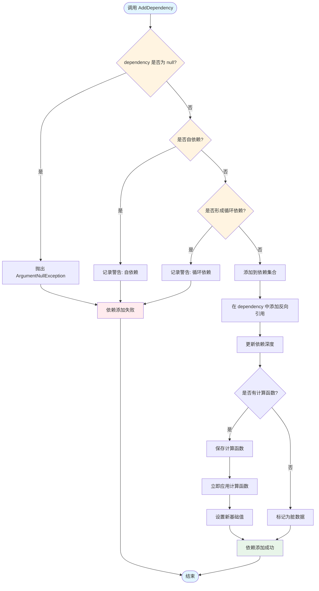

**依赖更新流程（当 dependency 值变化时）：**

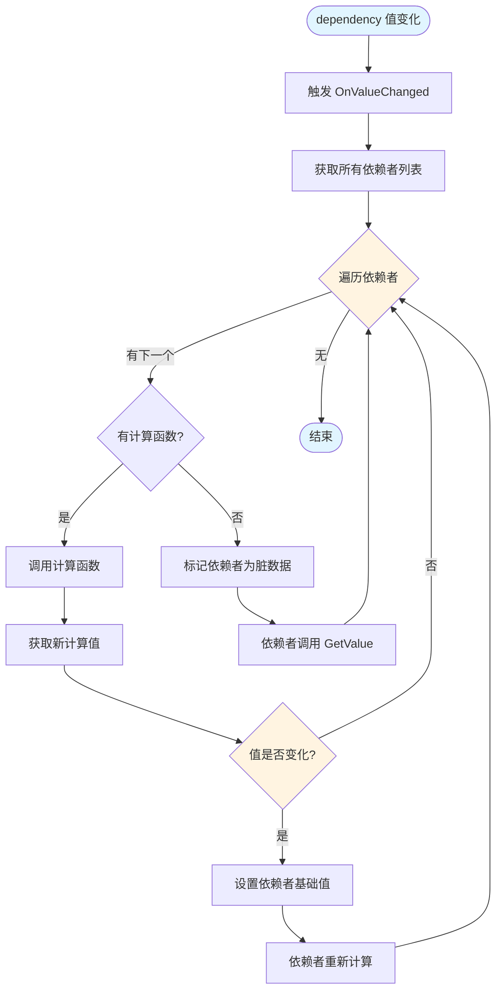

**说明：**
- 循环依赖检测：使用深度优先搜索检测循环，最大深度限制为 100 层
- 自动传播：依赖属性值变化时，所有依赖者自动更新
- 计算函数：支持自定义计算逻辑，接收依赖属性和新值，返回依赖者的新基础值
- 反向引用：维护双向关系，方便快速查找依赖者

---
## 序列图

### 创建并修改属性的完整流程

展示从创建属性到修改值的完整交互过程。

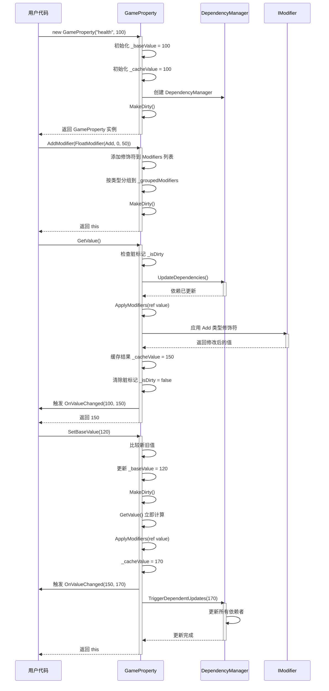

**说明：**
- 构造函数会初始化基础值、缓存值并标记为脏数据
- 添加修饰符会立即标记为脏，但不立即计算
- `GetValue()` 检查脏标记，仅在必要时重新计算
- `SetBaseValue()` 会立即触发计算并传播到依赖者

---

### 事件系统交互流程

展示三种事件（OnBaseValueChanged、OnValueChanged、OnDirtyAndValueChanged）的触发时机和交互过程。

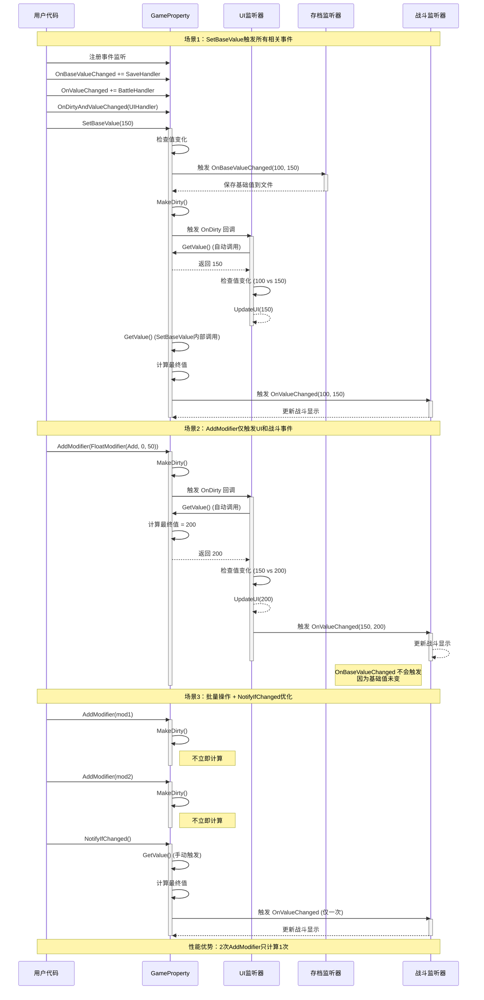

**说明：**

**事件触发规则：**
1. **OnBaseValueChanged**：仅 `SetBaseValue()` 触发
2. **OnValueChanged**：`GetValue()` 计算后值变化时触发
3. **OnDirtyAndValueChanged**：脏标记时自动调用 `GetValue()` 并在值变化时触发回调

**性能对比：**
- **场景1**（SetBaseValue）：3个事件触发，1次计算
- **场景2**（AddModifier + OnDirtyAndValueChanged）：2个事件触发，1次计算
- **场景3**（批量 + NotifyIfChanged）：1个事件触发，1次计算（最优）

**使用建议：**
- 存档系统：监听 `OnBaseValueChanged`
- 战斗/计算：监听 `OnValueChanged`（延迟计算）
- UI 更新：使用 `OnDirtyAndValueChanged`（立即响应）
- 批量操作：使用 `NotifyIfChanged()` 手动触发

---

### 依赖关系建立与传播流程

展示属性间依赖关系的建立和值变化传播过程。

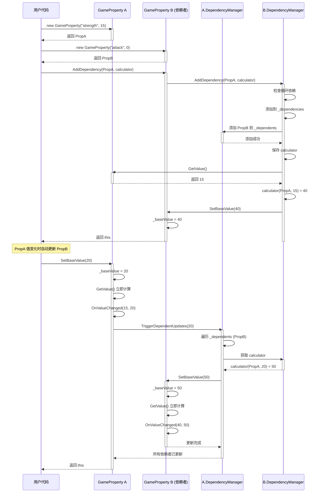

**说明：**
- 依赖建立时会立即计算并设置依赖者的基础值
- 双向引用：依赖者记录依赖项，依赖项记录依赖者
- 自动传播：值变化时自动触发所有依赖者的计算函数
- 链式更新：依赖者的值变化会继续传播到其依赖者（形成依赖链）

---

## 状态图

### GameProperty 状态转换

展示 GameProperty 的内部状态和转换条件。

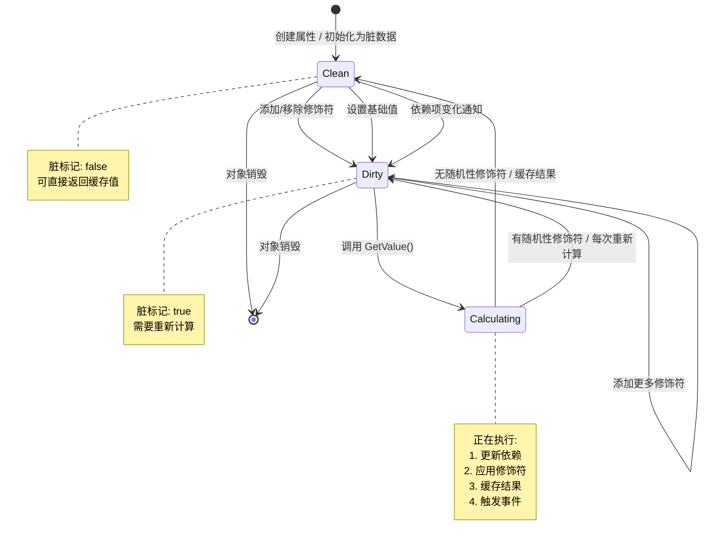

**状态说明：**
- **Clean（干净）**：缓存值有效，可直接返回，无需重新计算
- **Dirty（脏数据）**：缓存值过期，需要重新计算
- **Calculating（计算中）**：正在执行值计算流程

**转换条件：**
- `Clean → Dirty`：修改基础值、添加/移除修饰符、依赖项通知
- `Dirty → Calculating`：调用 `GetValue()`
- `Calculating → Clean`：计算完成且无随机性修饰符
- `Calculating → Dirty`：计算完成但存在随机性修饰符（如非 Clamp 的 RangeModifier）

---

### CombineGameProperty 生命周期状态

展示组合属性的生命周期状态。

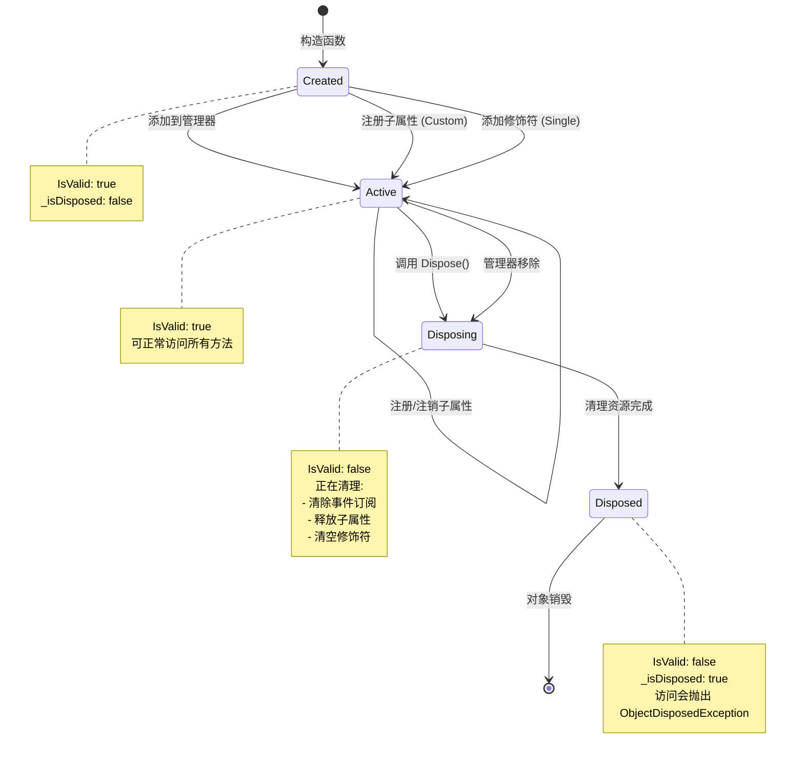

**状态说明：**
- **Created（已创建）**：对象刚创建，尚未使用
- **Active（活跃）**：正常使用中，可读写操作
- **Disposing（释放中）**：正在清理资源
- **Disposed（已释放）**：资源已释放，不可再使用

**最佳实践：**
- 使用前检查 `IsValid()` 确保对象未释放
- 不再使用时调用 `Dispose()` 释放资源
- 管理器的 `Remove()` 会自动调用 `Dispose()`

---

## 性能优化相关

### 脏标记优化机制

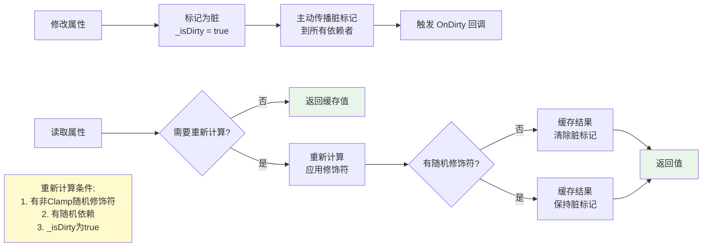

**性能特性：**
- **主动传播**：MakeDirty时主动传播脏标记到依赖者，避免GetValue时递归检查
- **缓存失效**：脏标记传播时同时失效HasDirtyDependencies缓存
- **早期返回**：已脏属性调用MakeDirty立即返回，避免重复传播
- **批量操作**：批量添加修饰符使用AddModifiers而非多次AddModifier
- **随机修饰符**：非Clamp的RangeModifier会导致每次重新计算
- **线程安全**：GamePropertyManager使用ConcurrentDictionary支持并发访问

---

## 相关资源

- [用户使用指南](./UserGuide.md) - 快速开始和常见场景
- [API 参考文档](./APIReference.md) - 详细的方法签名和参数说明

---

**维护者：** EasyPack 团队  
**联系方式：** 提交 GitHub Issue 或 Pull Request  
**许可证：** 遵循项目主许可证
