# Inventory System - Mermaid 图集文档

**适用EasyPack版本：** EasyPack v1.7.0  
**最后更新:** 2025-11-06

---

## 概述

本文档提供 **Inventory System** 的可视化架构和数据流图表，帮助开发者快速理解系统设计。

**图表类型：**
- [类图 (Class Diagram)](#类图) - 展示类型结构和关系
- [流程图 (Flowchart)](#流程图) - 展示执行流程和逻辑分支
- [序列图 (Sequence Diagram)](#序列图) - 展示对象间交互时序
- [状态图 (State Diagram)](#状态图) - 展示状态转换逻辑

---

## 目录

- [Inventory System - Mermaid 图集文档](#inventory-system---mermaid-图集文档)
  - [概述](#概述)
  - [目录](#目录)
  - [服务架构图](#服务架构图)
    - [InventoryService 架构图](#inventoryservice-架构图)
    - [服务初始化流程图](#服务初始化流程图)
  - [类图](#类图)
    - [核心类图](#核心类图)
    - [条件系统类图](#条件系统类图)
  - [流程图](#流程图)
    - [添加物品流程图](#添加物品流程图)
    - [跨容器转移流程图](#跨容器转移流程图)
    - [序列化流程图](#序列化流程图)
  - [序列图](#序列图)
    - [服务初始化序列图](#服务初始化序列图)
    - [物品添加序列图](#物品添加序列图)
    - [InventoryService 跨容器操作序列图](#inventoryservice-跨容器操作序列图)
  - [状态图](#状态图)
    - [槽位状态转换图](#槽位状态转换图)
    - [服务生命周期状态图](#服务生命周期状态图)
  - [数据流图](#数据流图)
    - [物品数据流图](#物品数据流图)
  - [延伸阅读](#延伸阅读)

---

## 服务架构图

### InventoryService 架构图

**说明：**  
展示 InventoryService 的服务架构，包括与 EasyPack 架构的集成关系。

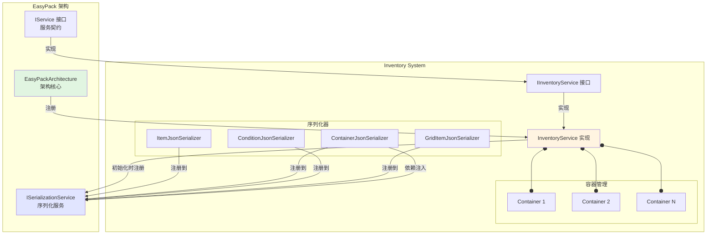

**架构要点：**

1. **服务集成**：InventoryService 实现 `IService` 接口，由 EasyPackArchitecture 管理
2. **自动注册**：服务初始化时自动注册所有序列化器到 `ISerializationService`
3. **依赖注入**：ContainerSerializer 通过构造函数注入 `ISerializationService`
4. **容器管理**：服务管理多个容器实例，支持优先级和分类

---

### 服务初始化流程图

**说明：**  
展示 InventoryService 的初始化过程。

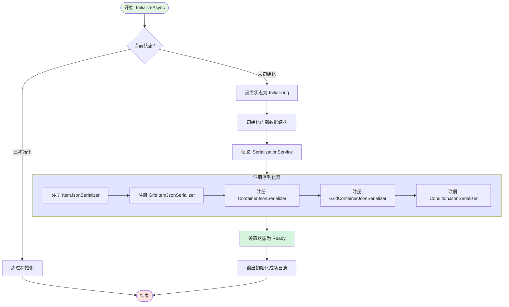

**初始化说明：**

1. **状态检查**：避免重复初始化
2. **数据初始化**：初始化内部字典和集合
3. **序列化器注册**：
   - 获取 `ISerializationService` 实例
   - 注册所有类型的序列化器
   - ContainerJsonSerializer 注入 `ISerializationService`
4. **状态更新**：设置为 Ready 状态，服务可用

---

## 类图

### 核心类图

**说明：**  
展示 Inventory System 的核心类型、继承关系和主要依赖。

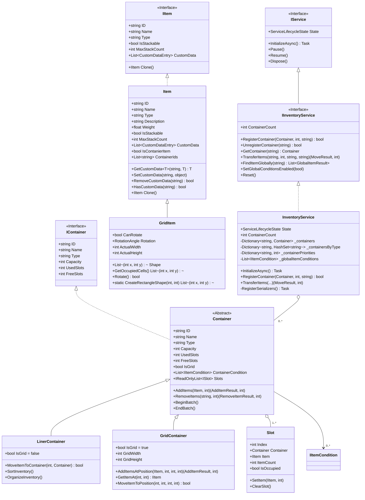

**图例说明：**
- `<<Interface>>`：接口，定义契约
- `<<Abstract>>`：抽象类，不可直接实例化
- `|--`：继承关系（实线 + 空心三角）
- `..|>`：接口实现（虚线 + 空心三角）
- `-->`：依赖关系（实线 + 箭头）
- `o--`：聚合关系（空心菱形）

**设计要点：**
1. `InventoryService` 实现 `IService` 接口，集成到 EasyPack 架构
2. 服务管理多个容器，支持优先级、分类和全局条件
3. `Container` 是抽象基类，提供通用的物品管理功能
4. `LinerContainer` 适用于传统背包，`GridContainer` 适用于网格布局

---

### 条件系统类图

**说明：**  
展示物品条件系统的类型和组合关系。

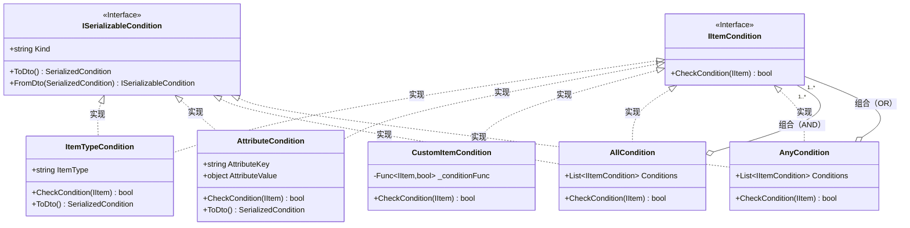

**设计要点：**
1. `ItemTypeCondition` 用于简单的类型过滤
2. `AttributeCondition` 用于基于自定义属性的过滤
3. `CustomItemCondition` 支持 lambda 表达式自定义逻辑
4. `AllCondition` 和 `AnyCondition` 支持复杂条件组合
5. 实现 `ISerializableCondition` 的条件可序列化

---

## 流程图

### 添加物品流程图

**说明：**  
展示 `Container.AddItems()` 的执行流程，包括堆叠、条件检查、槽位分配。

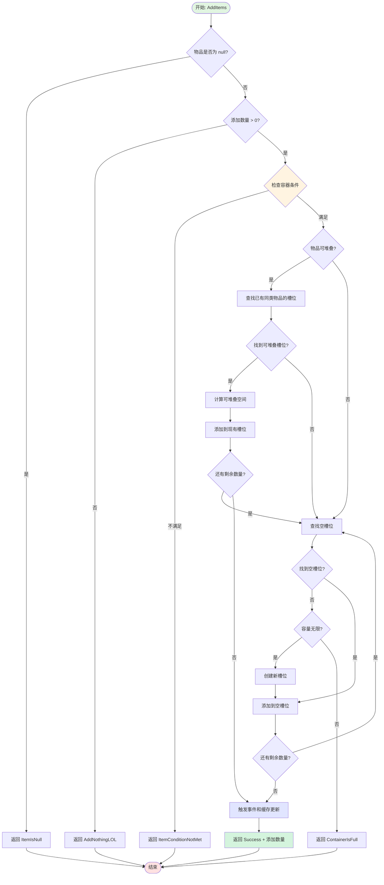

**流程说明：**

1. **前置检查**：验证物品和数量的合法性
2. **条件检查**：验证容器条件（如类型限制）
3. **堆叠处理**：
   - 可堆叠物品优先填入已有同类物品的槽位
   - 计算堆叠上限，避免超过 `MaxStackCount`
4. **槽位分配**：
   - 优先使用空槽位
   - 无限容量容器自动创建新槽位
5. **事件触发**：更新缓存、触发 `OnItemAddResult` 事件
---

### 跨容器转移流程图

**说明：**  
展示 `InventoryManager.TransferItems()` 的执行流程。

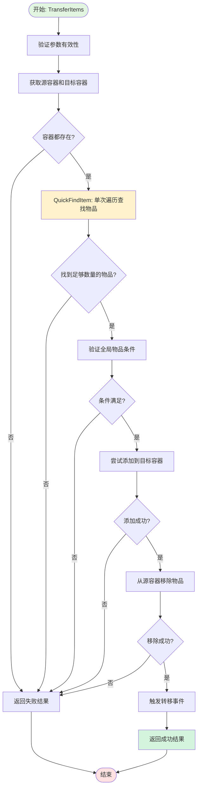

**流程说明：**

1. **容器验证**：确认源容器和目标容器都存在
2. **物品检查**：验证源容器中有足够的物品
3. **移除操作**：从源容器移除指定数量
4. **添加操作**：添加到目标容器
5. **回滚机制**：如果添加失败，重新添加回源容器
6. **事件触发**：成功时触发转移相关事件

**最佳实践：**
- 使用 `TransferItems()` 代替手动 `RemoveItems()` + `AddItems()`
- 回滚机制确保数据一致性

---

### 序列化流程图

**说明：**  
展示物品和容器序列化的完整流程，包括依赖注入和自动注册。

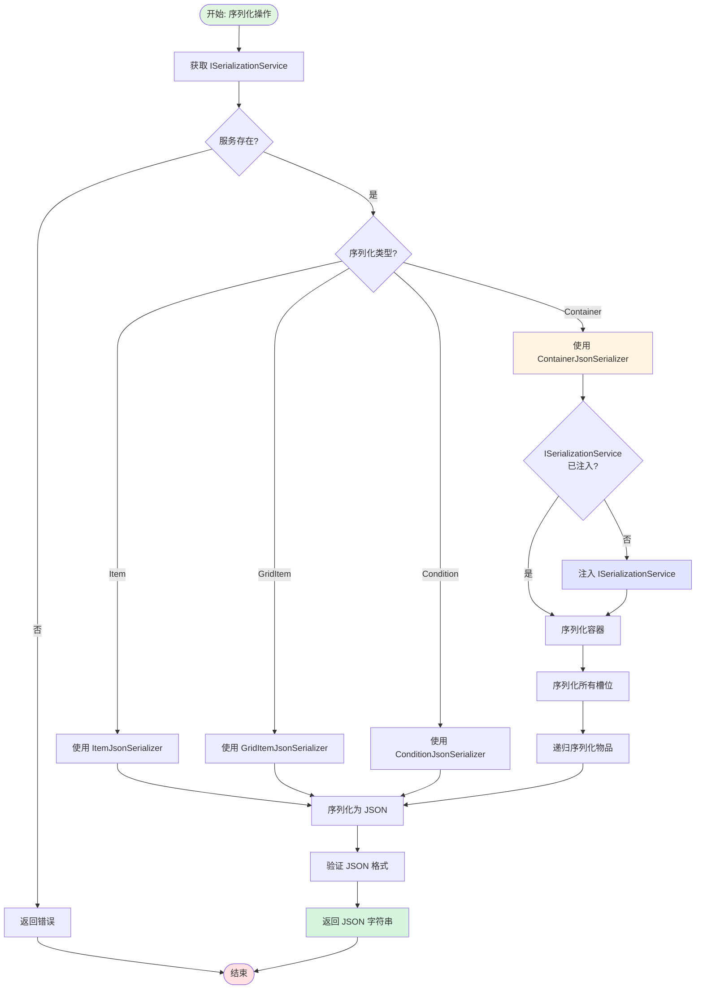

**序列化说明：**

1. **服务获取**：通过依赖注入获取 `ISerializationService`
2. **类型识别**：根据对象类型选择对应的序列化器
3. **依赖注入**：
   - `ContainerJsonSerializer` 需要注入 `ISerializationService`
   - 用于递归序列化容器内的物品
4. **递归序列化**：
   - 容器序列化时递归序列化所有槽位
   - 槽位序列化时递归序列化物品
5. **格式验证**：确保生成的 JSON 格式正确

**自动注册流程：**

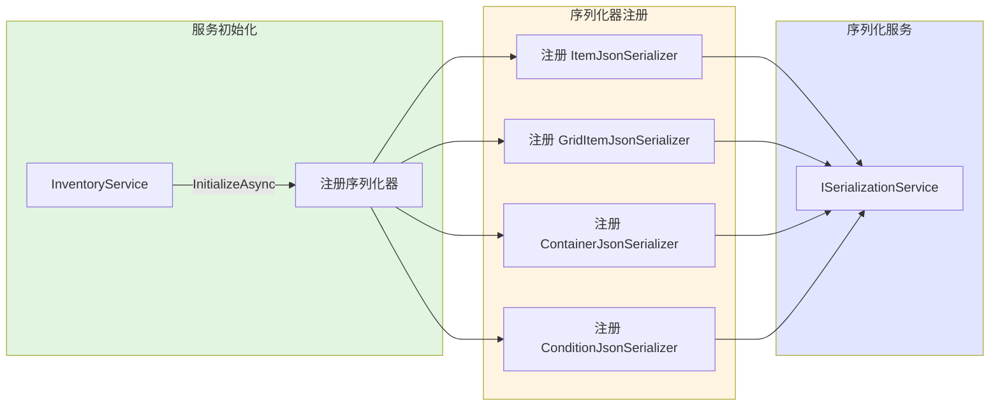

**注册说明：**
- 服务初始化时自动注册所有序列化器
- `ContainerJsonSerializer` 构造函数接收 `ISerializationService` 参数
- 注册后即可通过服务进行统一序列化管理

---

## 序列图

### 服务初始化序列图

**说明：**  
展示 InventoryService 初始化过程，包括序列化器自动注册。

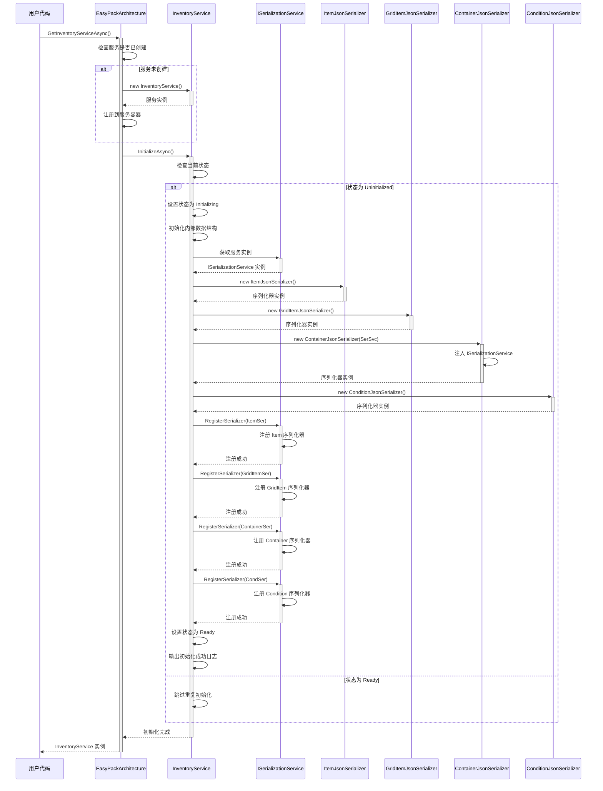

**时序说明：**

1. **服务获取**：通过 `EasyPackArchitecture.GetInventoryServiceAsync()` 获取服务，延迟初始化模式
2. **初始化检查**：检查服务状态，避免重复初始化
3. **状态转换**：设置为 `Initializing` 状态，初始化内部数据结构
4. **序列化器创建**：获取 `ISerializationService`，创建所有序列化器，`ContainerJsonSerializer` 依赖注入
5. **自动注册**：依次注册所有序列化器到 `ISerializationService`
6. **完成初始化**：设置状态为 `Ready`，返回服务实例

**设计要点：**
- **延迟初始化**：服务在首次使用时才初始化
- **依赖注入**：`ContainerJsonSerializer` 需要 `ISerializationService`
- **自动注册**：初始化时自动注册所有序列化器
- **状态管理**：通过 `ServiceLifecycleState` 管理生命周期

---

### 物品添加序列图

**说明：**  
展示用户代码调用 `AddItems()` 时的完整交互时序。

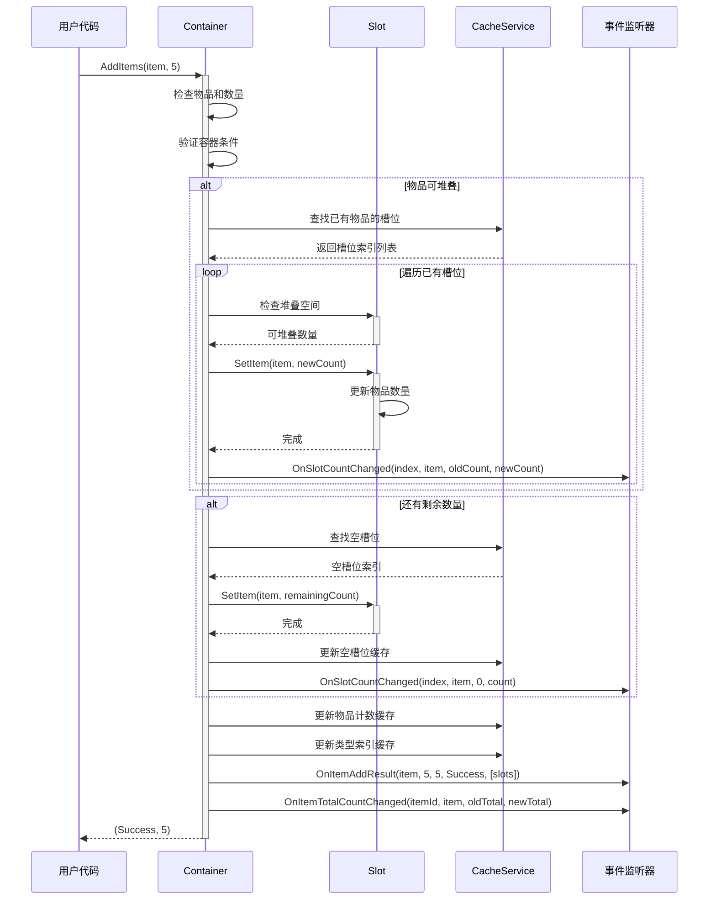

**时序说明：**

1. **初始调用**（1-3）：用户调用 `AddItems()`，容器执行前置检查
2. **堆叠处理**（4-10）：
   - 查询缓存获取已有物品槽位
   - 遍历槽位，逐个填充直到堆叠上限
   - 触发槽位数量变更事件
3. **新槽位分配**（11-16）：
   - 剩余数量分配到空槽位
   - 更新缓存索引
4. **事件触发**（17-20）：
   - 触发添加结果事件
   - 触发物品总数变更事件
5. **返回结果**（21）：返回成功状态和实际添加数量

**性能优化：**
- `CacheService` 避免每次遍历所有槽位
- 批处理模式可延迟事件触发

---

### InventoryService 跨容器操作序列图

**说明：**  
展示 `InventoryService` 管理多个容器时的交互。

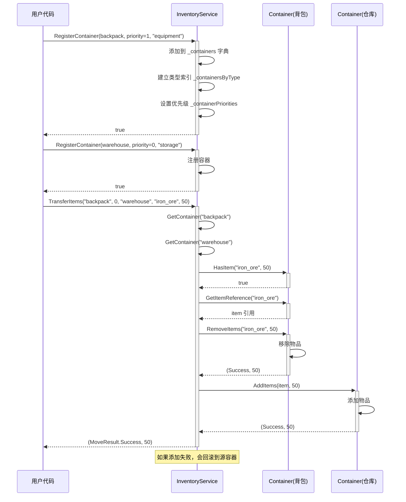

**时序说明：**

1. **容器注册**（1-7）：
   - 注册背包和仓库到服务
   - 设置优先级（背包优先级更高）
   - 支持分类标签
2. **转移操作**（8-20）：
   - 验证源容器和目标容器存在
   - 从源容器移除物品
   - 添加到目标容器
   - 返回转移结果和实际转移数量
   - 失败时自动回滚

**优势：**
- `InventoryService` 实现 `IService` 接口，集成到 EasyPack 架构
- 自动处理回滚，确保数据一致性
- 支持全局物品搜索和跨容器操作

---

## 状态图

### 槽位状态转换图

**说明：**  
展示槽位（Slot）的生命周期状态和转换条件。

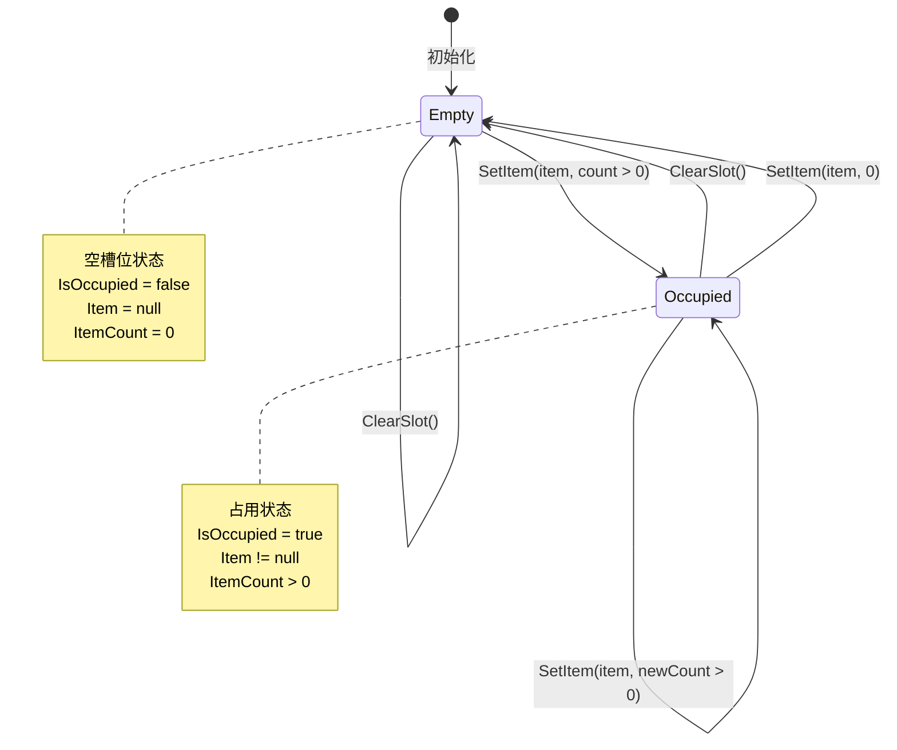

**状态说明：**

| 状态 | 说明 | 允许的操作 |
|------|------|-----------|
| `Empty` | 槽位为空，未存储任何物品 | `SetItem()` |
| `Occupied` | 槽位已占用，存储物品和数量 | `SetItem()`, `ClearSlot()` |

**转换条件：**

1. `Empty → Occupied`：调用 `SetItem(item, count)` 且 `count > 0`
2. `Occupied → Empty`：调用 `ClearSlot()` 或 `SetItem(item, 0)`
3. `Occupied → Occupied`：调用 `SetItem(item, newCount)` 且 `newCount > 0`

**最佳实践：**
- 使用 `IsOccupied` 属性判断槽位状态，不要直接检查 `Item` 是否为 null
- `SetItem()` 会自动处理状态转换和事件触发

---

### 服务生命周期状态图

**说明：**  
展示 InventoryService 的生命周期状态和转换条件。

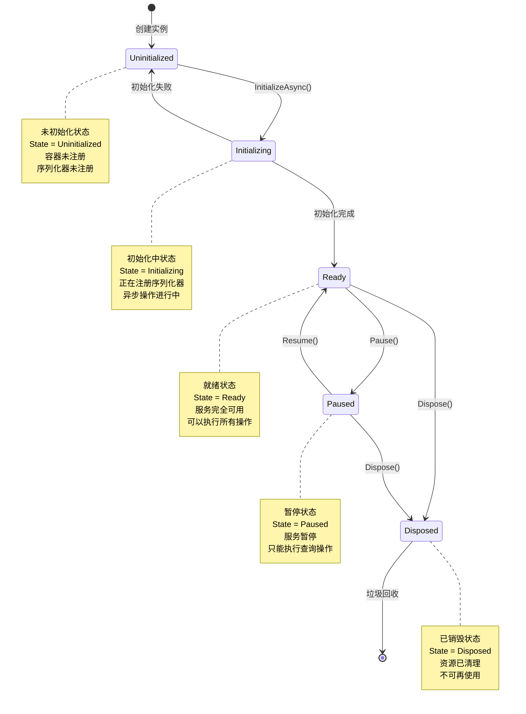

**状态说明：**

| 状态 | 枚举值 | 说明 | 允许的操作 |
|------|--------|------|-----------|
| `Uninitialized` | `ServiceLifecycleState.Uninitialized` | 服务刚创建，未初始化 | `InitializeAsync()` |
| `Initializing` | `ServiceLifecycleState.Initializing` | 正在初始化 | 无（等待完成） |
| `Ready` | `ServiceLifecycleState.Ready` | 初始化完成，服务可用 | 所有操作 |
| `Paused` | `ServiceLifecycleState.Paused` | 服务暂停 | 查询操作 |
| `Disposed` | `ServiceLifecycleState.Disposed` | 服务已销毁 | 无 |

**转换条件：**

1. `Uninitialized → Initializing`：调用 `InitializeAsync()`
2. `Initializing → Ready`：初始化成功完成
3. `Initializing → Uninitialized`：初始化失败，回滚
4. `Ready → Paused`：调用 `Pause()`
5. `Paused → Ready`：调用 `Resume()`
6. `Ready → Disposed`：调用 `Dispose()`
7. `Paused → Disposed`：调用 `Dispose()`

**最佳实践：**
- 总是检查 `State` 属性再执行操作
- 使用 `InitializeAsync()` 初始化服务，避免重复初始化
- 在应用暂停时调用 `Pause()`，恢复时调用 `Resume()`
- 在应用退出前调用 `Dispose()` 清理资源

## 数据流图

### 物品数据流图

**说明：**  
展示物品数据在系统各组件间的流动路径。

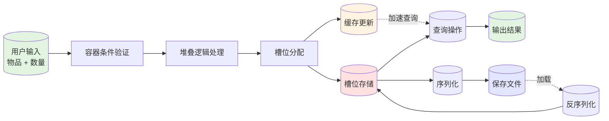

**数据流说明：**

1. **输入阶段**：用户提供物品和数量
2. **验证阶段**：检查容器条件（类型、属性等）
3. **堆叠处理**：计算堆叠逻辑，决定数量分配
4. **槽位分配**：将物品分配到具体槽位
5. **持久化**：
   - 存储到槽位（内存）
   - 更新缓存索引
6. **查询阶段**：
   - 缓存加速查询（如 `FindItemSlotIndex()`）
   - 直接从槽位读取
7. **序列化**：
   - 保存到 JSON 文件
   - 反序列化恢复数据

**性能优化：**
- 缓存系统减少遍历次数（空槽位索引、物品位置索引）
- 批处理模式减少事件触发频率

---

## 延伸阅读

- [用户使用指南](./UserGuide.md) - 查看完整使用场景
- [API 参考文档](./APIReference.md) - 查阅详细 API 说明

---

**维护者：** NEKOPACK 团队  
**图表工具：** Mermaid v10.x  
**反馈渠道：** [GitHub Issues](https://github.com/CutrelyAlex/UnityEasyPack/issues)
