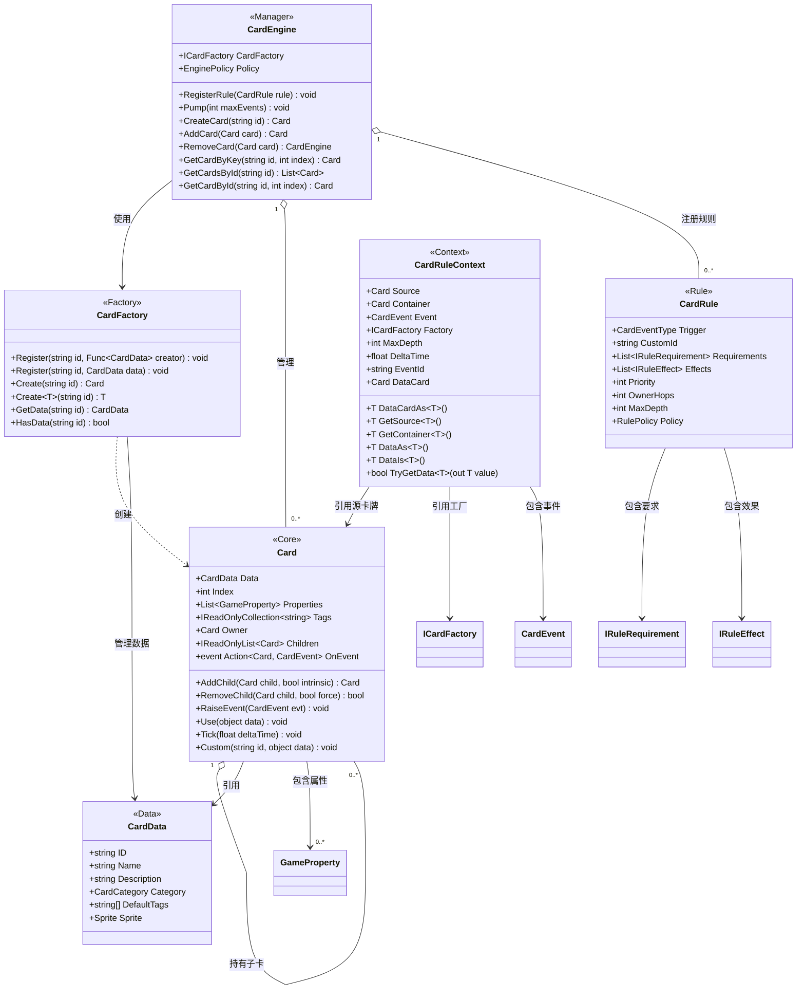
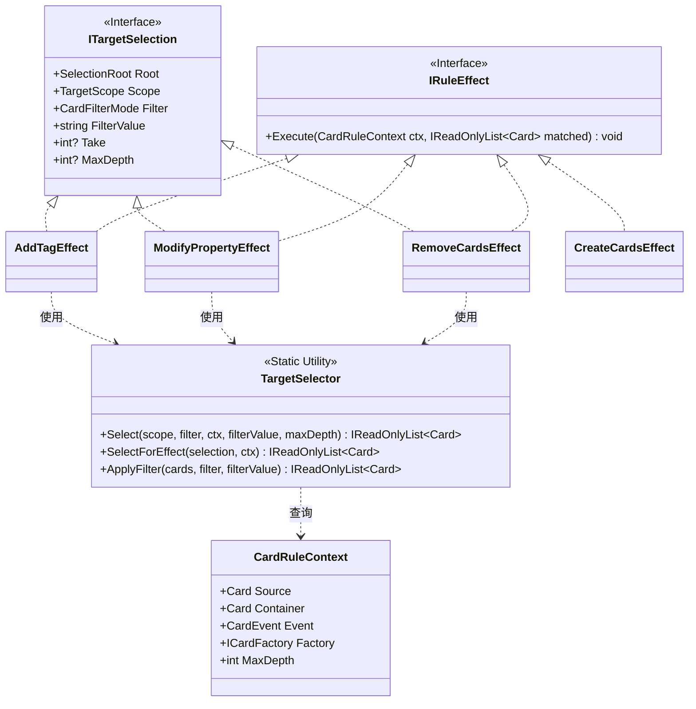
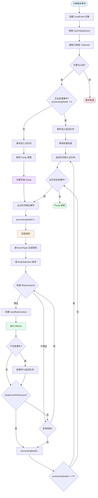
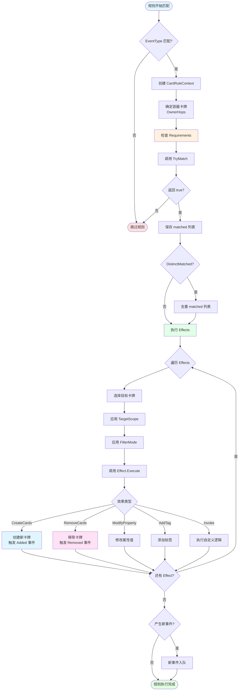
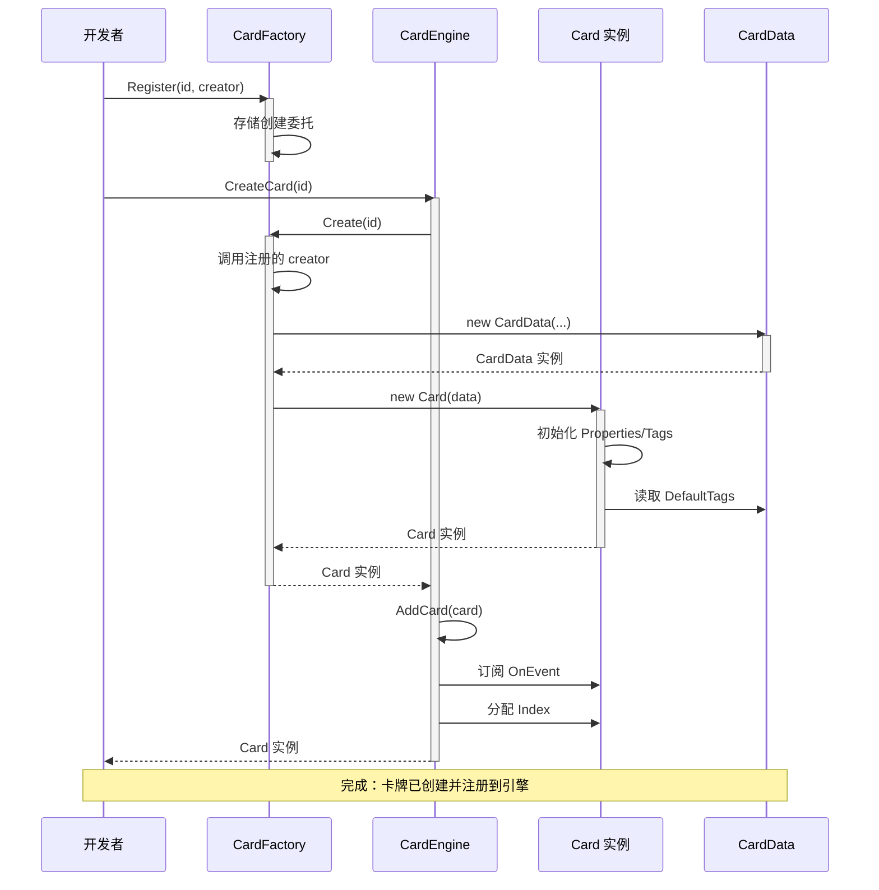
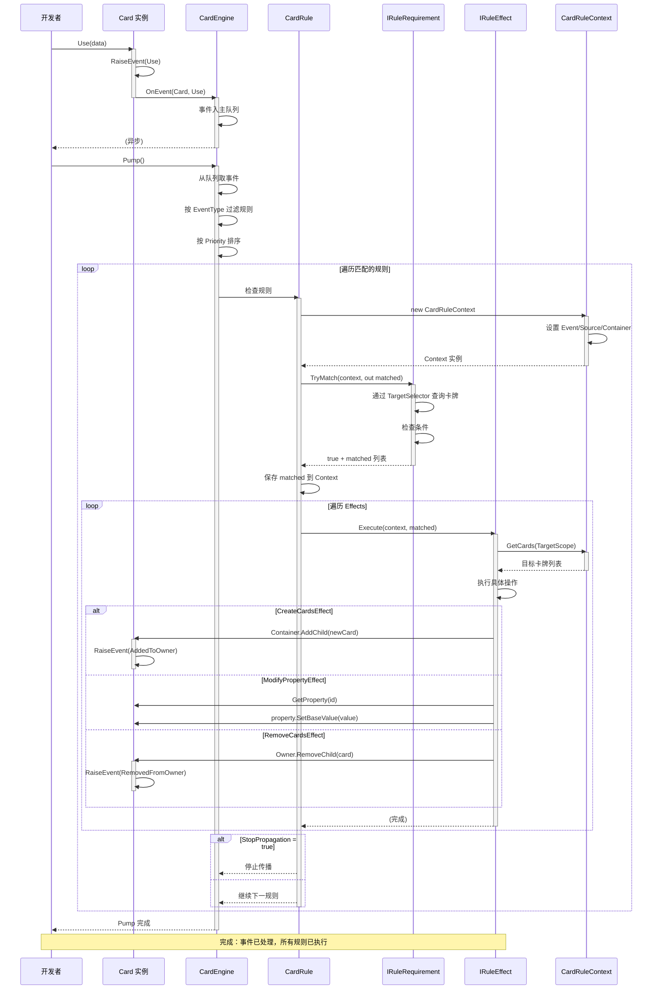
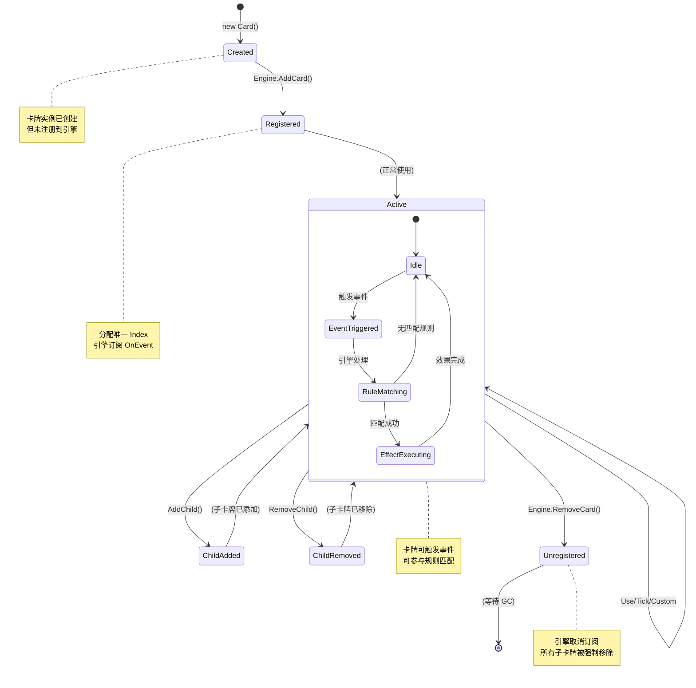
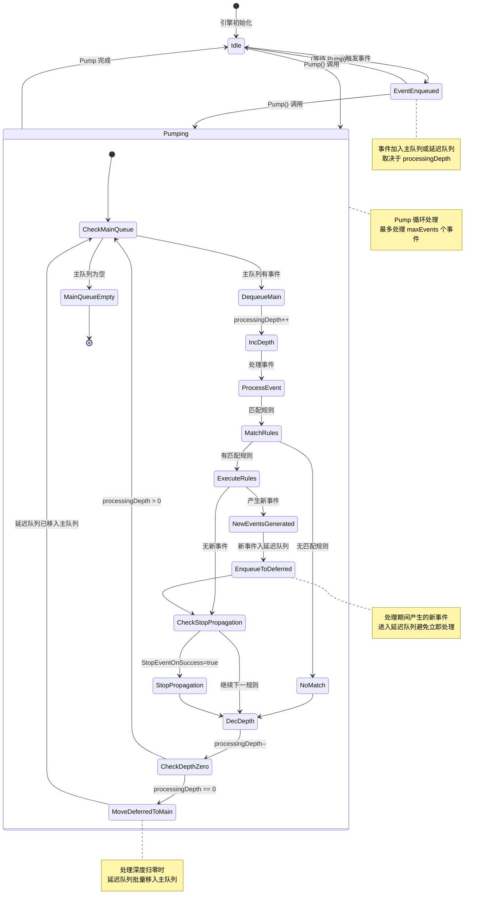
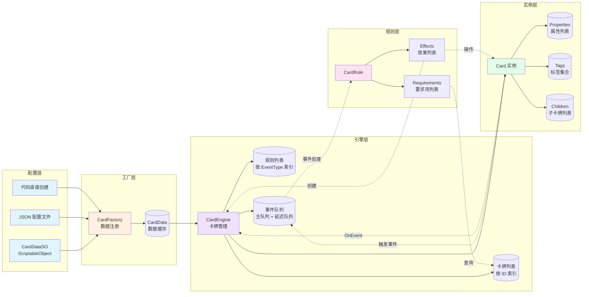

# EmeCard 系统 - Mermaid 图集文档

**适用 EasyPack 版本：** EasyPack v1.7.0  
**最后更新：** 2025-11-09

---

## 概述

本文档提供 **EmeCard 系统** 的可视化架构和数据流图表，帮助开发者快速理解系统设计。

---

## 目录

- [EmeCard 系统 - Mermaid 图集文档](#emecard-系统---mermaid-图集文档)
  - [概述](#概述)
  - [目录](#目录)
  - [类图](#类图)
    - [核心类图](#核心类图)
    - [规则组件类图](#规则组件类图)
    - [效果系统类图](#效果系统类图)
  - [流程图](#流程图)
    - [事件处理流程](#事件处理流程)
    - [规则匹配与执行流程](#规则匹配与执行流程)
  - [序列图](#序列图)
    - [卡牌创建与注册序列](#卡牌创建与注册序列)
    - [规则触发与效果执行序列](#规则触发与效果执行序列)
  - [状态图](#状态图)
    - [卡牌生命周期状态图](#卡牌生命周期状态图)
    - [事件队列处理状态图](#事件队列处理状态图)
  - [数据流图](#数据流图)
    - [系统核心数据流](#系统核心数据流)

---

## 类图

### 核心类图

**说明：**  
展示 EmeCard 系统的核心类型、继承关系和主要依赖。包含卡牌、引擎、工厂和规则的核心设计。



**图例说明：**
- `<<Core>>`：核心类，系统的主要入口点
- `<<Data>>`：数据类，存储静态配置
- `<<Manager>>`：管理器类，协调系统运作
- `<<Factory>>`：工厂类，负责对象创建
- `<<Rule>>`：规则类，定义事件响应逻辑
- `<<Context>>`：上下文类，携带执行环境信息
- `o--`：聚合关系（整体与部分）
- `-->`：依赖关系
- `..>`：创建关系

**设计要点：**
1. `Card` 是系统的核心实体，支持父子层级结构
2. `CardEngine` 作为中心管理器，协调卡牌生命周期和规则执行
3. `CardFactory` 采用委托注册模式，支持灵活的卡牌创建
4. `CardRule` 通过组合 Requirements 和 Effects 实现声明式规则定义
5. `CardRuleContext` 提供规则执行时的查询和操作能力

**相关文档：**
- [Card API 文档](./APIReference.md#card-类)
- [CardEngine API 文档](./APIReference.md#cardengine-类)
- [CardRule API 文档](./APIReference.md#cardrule-类)

---

### 规则组件类图

**说明：**  
展示规则系统的接口和内置实现，包括要求项（Requirements）和效果（Effects）。

```mermaid
classDiagram
    class IRuleRequirement {
        <<Interface>>
        +TryMatch(CardRuleContext ctx, out List~Card~ matched) bool
    }

    class IRuleEffect {
        <<Interface>>
        +Execute(CardRuleContext ctx, IReadOnlyList~Card~ matched) void
    }

    class ITargetSelection {
        <<Interface>>
        +Select(CardRuleContext ctx) List~Card~
    }

    class CardsRequirement {
        +SelectionRoot Root
        +TargetScope Scope
        +CardFilterMode FilterMode
        +string FilterValue
        +int MinCount
        +int MaxMatched
        +int? MaxDepth
        +TryMatch(ctx, out matched) bool
    }

    class ConditionRequirement {
        +Func~CardRuleContext, bool~ Condition
        +TryMatch(ctx, out matched) bool
    }

    class AllRequirement {
        +List~IRuleRequirement~ Requirements
        +TryMatch(ctx, out matched) bool
    }

    class AnyRequirement {
        +List~IRuleRequirement~ Requirements
        +TryMatch(ctx, out matched) bool
    }

    class NotRequirement {
        +IRuleRequirement Requirement
        +TryMatch(ctx, out matched) bool
    }

    class CreateCardsEffect {
        +List~string~ CardIds
        +int CountPerId
        +Execute(ctx, matched) void
    }

    class RemoveCardsEffect {
        +SelectionRoot Root
        +TargetScope Scope
        +CardFilterMode Filter
        +string FilterValue
        +int? Take
        +int? MaxDepth
        +Execute(ctx, matched) void
    }

    class ModifyPropertyEffect {
        +SelectionRoot Root
        +TargetScope Scope
        +CardFilterMode Filter
        +string FilterValue
        +int? Take
        +int? MaxDepth
        +string PropertyName
        +Mode ApplyMode
        +IModifier Modifier
        +float Value
        +Execute(ctx, matched) void
    }

    class AddTagEffect {
        +SelectionRoot Root
        +TargetScope Scope
        +CardFilterMode Filter
        +string FilterValue
        +int? Take
        +int? MaxDepth
        +string Tag
        +Execute(ctx, matched) void
    }

    class InvokeEffect {
        +Action~CardRuleContext, IReadOnlyList~Card~~ Action
        +Execute(ctx, matched) void
    }

    IRuleRequirement <|.. CardsRequirement
    IRuleRequirement <|.. ConditionRequirement
    IRuleRequirement <|.. AllRequirement
    IRuleRequirement <|.. AnyRequirement
    IRuleRequirement <|.. NotRequirement
    IRuleEffect <|.. CreateCardsEffect
    IRuleEffect <|.. RemoveCardsEffect
    IRuleEffect <|.. ModifyPropertyEffect
    IRuleEffect <|.. AddTagEffect
    IRuleEffect <|.. InvokeEffect
    AllRequirement o-- "2..*" IRuleRequirement
    AnyRequirement o-- "2..*" IRuleRequirement
    NotRequirement o-- "1" IRuleRequirement
```



**图例说明：**
- `<|..`：接口实现关系（虚线 + 空心三角）

**设计要点：**
1. **要求项系统**：通过 `IRuleRequirement` 定义规则生效条件
   - `CardsRequirement`：检查特定卡牌是否存在
   - `ConditionRequirement`：基于自定义谓词判断
   - `AllRequirement/AnyRequirement`：逻辑组合（AND/OR）
   - `NotRequirement`：逻辑取反
2. **效果系统**：通过 `IRuleEffect` 定义规则执行行为
   - `CreateCardsEffect`：创建新卡牌
   - `RemoveCardsEffect`：移除卡牌
   - `ModifyPropertyEffect`：修改属性值
   - `AddTagEffect`：添加标签
   - `InvokeEffect`：执行自定义逻辑
3. **组合模式**：要求项支持嵌套组合，构建复杂条件

**相关文档：**
- [IRuleRequirement API 文档](./APIReference.md#irulerequirement-接口)
- [IRuleEffect API 文档](./APIReference.md#iruleeffect-接口)
- [内置要求项文档](./APIReference.md#内置要求项)
- [内置效果文档](./APIReference.md#内置效果)

---

### 效果系统类图

**说明：**  
展示效果系统的目标选择机制和执行流程。



**设计要点：**
1. **接口分离原则**：`IRuleEffect` 定义执行行为，`ITargetSelection` 定义目标选择配置
2. **目标选择配置**（`ITargetSelection` 属性）：
   - `Root`：起点锚点（源卡牌、容器）
   - `Scope`：选择范围（匹配卡牌、子级、后代）
   - `Filter`/`FilterValue`：过滤条件（按 ID、标签、类别）
   - `Take`：数量限制
   - `MaxDepth`：递归深度限制
3. **静态工具类**：`TargetSelector` 提供可重用的查询方法
4. **效果类实现**：
   - `RemoveCardsEffect`、`ModifyPropertyEffect`、`AddTagEffect` 实现两个接口
   - `CreateCardsEffect` 仅实现 `IRuleEffect`（不需要目标选择）
5. **上下文集成**：`CardRuleContext` 封装常用查询操作

**相关文档：**
- [TargetSelector API 文档](./APIReference.md#targetselector-类)
- [CardRuleContext API 文档](./APIReference.md#cardrulecontext-类)
- [目标选择枚举文档](./APIReference.md#枚举类型)

---

## 流程图

### 事件处理流程

**说明：**  
展示从事件触发到规则执行的完整流程，包括事件队列、规则匹配和效果执行。



**流程说明：**

1. **事件触发阶段**
   - 卡牌调用 `Use()`, `Tick()` 或 `Custom()` 方法
   - 创建 `CardEvent` 对象，包含事件类型和数据
   - 通过 `OnEvent` 事件通知所有订阅者

2. **事件入队阶段**
   - 引擎订阅 `OnEvent`，将事件加入主队列
   - 如果引擎正在处理事件（`_processingDepth > 0`），新事件进入延迟队列

3. **Pump 处理阶段**
   - 用户调用 `Engine.Pump()` 启动事件循环
   - 从主队列依次取出事件处理
   - 处理深度（`_processingDepth`）用于跟踪嵌套处理

4. **规则匹配阶段**
   - 按 `EventType` 过滤匹配的规则
   - 根据 `EnginePolicy.RuleSelection` 排序（注册顺序或优先级）
   - 调用 `Requirements.TryMatch()` 检查条件

5. **效果执行阶段**
   - 创建 `CardRuleContext` 上下文对象
   - 依次执行规则的所有 `Effects`
   - 效果可能产生新事件（如创建卡牌触发 `AddedToOwner` 事件）

6. **传播控制**
   - 如果 `RulePolicy.StopEventOnSuccess = true`，停止处理后续规则
   - 否则继续匹配下一条规则

7. **队列循环**
   - 处理深度归零后，将延迟队列中的事件批量移入主队列
   - 所有队列为空后，Pump 结束

**性能考虑：**
- 单次 Pump 最多处理 `maxEvents` 个事件（默认 2048），防止死循环
- 延迟队列机制避免在事件处理期间直接入队，保证处理顺序

**相关文档：**
- [CardEngine.Pump API 文档](./APIReference.md#pump)
- [事件类型文档](./APIReference.md#cardeventtype-枚举)
- [EnginePolicy 配置](./APIReference.md#enginepolicy-类)

---

### 规则匹配与执行流程

**说明：**  
详细展示单条规则的匹配和执行过程，包括要求检查、目标选择和效果执行。



**流程说明：**

1. **事件匹配阶段**
   - 检查规则的 `Trigger` 是否与当前事件匹配
   - 自定义事件额外检查 `CustomId`

2. **上下文准备阶段**
   - 创建 `CardRuleContext` 对象
   - 根据 `OwnerHops` 确定容器卡牌：
     - `0`：触发卡牌自身
     - `1`：触发卡牌的直接父级
     - `-1`：根容器（最顶层卡牌）
     - `N > 1`：向上 N 层父级

3. **要求检查阶段**
   - 调用所有 `Requirements` 的 `TryMatch()` 方法
   - 逻辑组合（All/Any/Not）递归检查子要求
   - 输出 `matched` 列表：满足条件的卡牌集合

4. **匹配结果处理**
   - 如果 `RulePolicy.DistinctMatched = true`，对 `matched` 去重
   - 传递给效果执行阶段

5. **效果执行阶段**
   - 遍历规则的所有 `Effects`
   - 每个效果独立选择目标卡牌：
     - 使用 `TargetScope` 确定查询范围
     - 使用 `Filter/FilterValue` 过滤结果
   - 调用 `Execute()` 执行具体操作

6. **副作用传播**
   - 效果可能触发新事件：
     - `CreateCardsEffect` → `AddedToOwner` 事件
     - `RemoveCardsEffect` → `RemovedFromOwner` 事件
   - 新事件自动加入引擎延迟队列

**典型场景示例：**

**场景 1：消耗资源创建卡牌**
```
触发: 玩家卡牌使用 (Use 事件)
要求: 存在 10 个金币卡牌
效果 1: 移除 10 个金币
效果 2: 创建 1 个宝箱
结果: 金币 -10, 宝箱 +1, 触发 Removed 和 Added 事件
```

**场景 2：属性修改组合**
```
触发: 装备武器 (Custom 事件)
要求: 触发者有"角色"标签
效果 1: 修改触发者的"攻击力"+10
效果 2: 添加"已装备"标签
结果: 角色攻击力增加, 获得装备状态标签
```

**相关文档：**
- [CardRule API 文档](./APIReference.md#cardrule-类)
- [CardRuleContext API 文档](./APIReference.md#cardrulecontext-类)
- [规则构建器文档](./APIReference.md#cardrulebuilder-类)

---

## 序列图

### 卡牌创建与注册序列

**说明：**  
展示从工厂注册数据到卡牌实例创建并加入引擎的完整交互过程。



**交互说明：**

1. **数据注册阶段**
   - 开发者调用 `Factory.Register()` 注册卡牌数据
   - 工厂存储 ID 到创建委托的映射

2. **实例创建阶段**
   - 开发者调用 `Engine.CreateCard()`
   - 引擎委托工厂创建实例
   - 工厂调用注册的 creator 委托，生成 `CardData`
   - 使用 `CardData` 构造 `Card` 实例

3. **初始化阶段**
   - Card 构造函数初始化 Properties 和 Tags
   - 从 `CardData.DefaultTags` 复制默认标签

4. **注册到引擎**
   - 引擎调用内部 `AddCard()` 方法
   - 订阅卡牌的 `OnEvent` 事件
   - 分配唯一的 `Index` 值（同 ID 卡牌按加入顺序编号）
   - 返回卡牌实例给开发者

**关键设计模式：**
- **工厂模式**：解耦卡牌创建逻辑
- **观察者模式**：引擎订阅卡牌事件
- **委托模式**：支持动态注册创建逻辑

**相关文档：**
- [CardFactory API 文档](./APIReference.md#cardfactory-类)
- [CardEngine.CreateCard 文档](./APIReference.md#createcard)
- [CardEngine.AddCard 文档](./APIReference.md#addcard)

---

### 规则触发与效果执行序列

**说明：**  
展示从卡牌触发事件到规则匹配、效果执行的详细交互序列。



**交互说明：**

1. **事件触发阶段**
   - 开发者调用 `Card.Use()` 触发事件
   - Card 内部调用 `RaiseEvent(Use)`
   - 通过 `OnEvent` 通知引擎，事件入队

2. **Pump 启动阶段**
   - 开发者调用 `Engine.Pump()` 启动事件循环
   - 引擎从队列取出事件
   - 按 `EventType` 过滤规则，按 `Priority` 排序

3. **规则匹配阶段**
   - 为每条规则创建 `CardRuleContext`
   - 调用 `Requirements.TryMatch()` 检查条件
   - Requirements 通过 Context 查询引擎中的卡牌
   - 返回满足条件的 `matched` 列表

4. **效果执行阶段**
   - 遍历规则的所有 `Effects`
   - 每个效果独立选择目标卡牌（通过 `TargetScope`）
   - 执行具体操作：
     - **CreateCardsEffect**：通过容器的 `AddChild()` 添加新卡牌，新卡牌触发 `AddedToOwner` 事件
     - **ModifyPropertyEffect**：修改目标卡牌的属性值
     - **RemoveCardsEffect**：通过 `Owner.RemoveChild()` 移除卡牌，卡牌触发 `RemovedFromOwner` 事件

5. **传播控制**
   - 如果规则设置 `StopEventOnSuccess = true`，停止处理后续规则
   - 否则继续匹配下一条规则

6. **循环结束**
   - 所有匹配规则执行完毕
   - Pump 返回，开发者代码继续执行

**级联事件示例：**
```
初始事件: Card.Use()
  → 匹配规则 A: CreateCardsEffect
    → 容器.AddChild(新卡牌)
      → 新卡牌触发: AddedToOwner 事件
        → 匹配规则 B: ModifyPropertyEffect
          → 修改新卡牌属性
```

**相关文档：**
- [CardEngine.Pump 文档](./APIReference.md#pump)
- [CardRule 执行流程](./APIReference.md#cardrule-类)
- [CardRuleContext 查询方法](./APIReference.md#cardrulecontext-类)

---

## 状态图

### 卡牌生命周期状态图

**说明：**  
展示卡牌从创建到销毁的完整生命周期状态转换。



**状态说明：**

1. **Created（已创建）**
   - 通过 `new Card()` 或 `Factory.Create()` 创建
   - 持有 `CardData` 和初始化的 Properties/Tags
   - 尚未注册到引擎，不会响应事件

2. **Registered（已注册）**
   - 通过 `Engine.AddCard()` 加入引擎
   - 分配唯一 `Index`
   - 引擎订阅 `OnEvent`
   - **注意**：引擎不会触发任何事件，只是开始监听

3. **Active（活跃状态）**
   - 可以触发事件：`Use()`, `Tick()`, `Custom()`
   - 可以参与规则匹配
   - 可以添加/移除子卡牌
   - **子状态机**：
     - **Idle（空闲）**：等待事件触发
     - **EventTriggered（事件触发）**：已调用 RaiseEvent
     - **RuleMatching（规则匹配）**：引擎正在匹配规则
     - **EffectExecuting（效果执行）**：规则效果正在执行

4. **ChildAdded（子卡牌已添加）**
   - 通过 `AddChild()` 添加子卡牌
   - 子卡牌触发 `AddedToOwner` 事件
   - 子卡牌的 `Owner` 指向当前卡牌

5. **ChildRemoved（子卡牌已移除）**
   - 通过 `RemoveChild()` 移除子卡牌
   - 子卡牌触发 `RemovedFromOwner` 事件
   - 子卡牌的 `Owner` 置为 `null`

6. **Unregistered（已注销）**
   - 通过 `Engine.RemoveCard()` 从引擎移除
   - 引擎取消订阅 `OnEvent`
   - **注意**：引擎不会触发事件，但如果卡牌有 Owner，通过 Owner.RemoveChild() 移除时会触发 `RemovedFromOwner` 事件
   - 卡牌等待垃圾回收

**状态转换触发条件：**

| 转换 | 触发方法 | 触发事件 |
|------|----------|----------|
| Created → Registered | `Engine.AddCard()` | 无 |
| Active → ChildAdded | `Card.AddChild()` | `AddedToOwner`（子卡牌触发） |
| ChildAdded → Active | 自动 | - |
| Active → ChildRemoved | `Card.RemoveChild()` | `RemovedFromOwner`（子卡牌触发） |
| ChildRemoved → Active | 自动 | - |
| Active → Unregistered | `Engine.RemoveCard()` | 无（引擎层面），如果有 Owner 则子卡牌触发 `RemovedFromOwner` |

**典型场景：**

**场景 1：装备武器**
```
玩家卡牌（Active）
  → AddChild(武器) 
    → 玩家进入 ChildAdded 状态
    → 武器触发 AddedToOwner 事件
  → 玩家返回 Active 状态
```

**场景 2：消耗卡牌**
```
金币卡牌（Active，属于玩家卡牌的子卡）
  → 玩家.RemoveChild(金币)
    → 金币触发 RemovedFromOwner 事件
    → 引擎匹配相关规则
  → 如果从引擎移除：Engine.RemoveCard(金币)
    → 金币进入 Unregistered 状态
```

**相关文档：**
- [Card 生命周期事件](./APIReference.md#事件)
- [CardEventType 枚举](./APIReference.md#cardeventtype-枚举)
- [AddChild/RemoveChild API](./APIReference.md#addchild)

---

### 事件队列处理状态图

**说明：**  
展示引擎事件队列的处理状态和转换逻辑。



**状态说明：**

1. **Idle（空闲状态）**
   - 引擎初始化完成或 Pump 执行完毕
   - 事件队列为空或等待 Pump 调用
   - 卡牌可以触发新事件

2. **EventEnqueued（事件已入队）**
   - 卡牌触发事件
   - 如果 `processingDepth == 0`，加入主队列
   - 如果 `processingDepth > 0`（正在处理事件），加入延迟队列
   - 等待开发者调用 `Pump()`

3. **Pumping（处理中）**
   - 开发者调用 `Engine.Pump()` 启动循环
   - **子状态**：
     - **CheckMainQueue**：检查主队列是否为空
     - **DequeueMain**：从主队列取出事件
     - **IncDepth**：增加处理深度（`processingDepth++`）
     - **ProcessEvent**：处理事件
     - **MatchRules**：匹配规则
     - **ExecuteRules**：执行规则效果
     - **NewEventsGenerated**：效果产生新事件
     - **EnqueueToDeferred**：新事件入延迟队列
     - **CheckStopPropagation**：检查是否停止传播
     - **StopPropagation**：停止处理后续规则
     - **DecDepth**：减少处理深度（`processingDepth--`）
     - **CheckDepthZero**：检查处理深度是否归零
     - **MoveDeferredToMain**：延迟队列批量移入主队列
     - **MainQueueEmpty**：主队列为空，Pump 结束

**队列处理策略：**

1. **处理深度跟踪**
   - `processingDepth` 跟踪当前处理的嵌套层级
   - 每开始处理一个事件时 +1，处理完成后 -1

2. **延迟队列机制**
   - 在事件处理期间（`processingDepth > 0`）产生的新事件进入延迟队列
   - 避免在处理过程中直接修改主队列
   - 当 `processingDepth` 归零时，延迟队列批量移入主队列

3. **新事件级联**
   - 效果产生的新事件首先进入延迟队列
   - 当前事件处理完成后，延迟队列的事件移入主队列
   - 在同一次 Pump 中继续处理，可能形成事件链

4. **防死循环保护**
   - 单次 Pump 最多处理 `maxEvents` 个事件（默认 2048）
   - 超出限制后强制结束 Pump

**典型处理流程：**

**场景 1：简单事件处理**
```
1. Card.Use() → 事件入主队列
2. Pump() 开始
3. 取出 Use 事件 → 匹配规则 → 执行效果
4. 无新事件 → 主队列为空 → 延迟队列为空 → Pump 结束
```

**场景 2：级联事件处理**
```
1. Card.Use() → 事件入主队列（processingDepth = 0）
2. Pump() 开始
3. processingDepth++ (1) → 取出 Use 事件 → 匹配规则 → CreateCardsEffect
4. Container.AddChild(新卡牌) → 新卡牌触发 AddedToOwner 事件 → 入延迟队列（processingDepth = 1）
5. processingDepth-- (0) → 延迟队列移入主队列
6. processingDepth++ (1) → 取出 AddedToOwner 事件 → 匹配规则 → 执行效果
7. processingDepth-- (0) → 主队列为空 → Pump 结束
```

**场景 3：深层级联事件**
```
1. Event A → 规则匹配 → 效果产生 Event B（入延迟队列）
2. 当前处理完成，延迟队列移入主队列
3. Event B → 规则匹配 → 效果产生 Event C（入延迟队列）
4. 当前处理完成，延迟队列移入主队列
5. Event C → 规则匹配 → 执行效果
6. 主队列为空 → Pump 结束
```

**相关文档：**
- [CardEngine.Pump 文档](./APIReference.md#pump)
- [EnginePolicy 配置](./APIReference.md#enginepolicy-类)
- [事件队列机制说明](./UserGuide.md#事件队列)

---

## 数据流图

### 系统核心数据流

**说明：**  
展示 EmeCard 系统中数据的流动路径，从配置到运行时状态的完整流程。



**数据流说明：**

1. **配置层 → 工厂层**
   - **ScriptableObject**：在 Unity Editor 中创建 `CardDataSO` 资源
   - **JSON 文件**：通过 `JsonUtility` 加载配置
   - **代码直接创建**：运行时通过 `new CardData()` 创建
   - 所有路径最终调用 `Factory.Register()` 注册数据

2. **工厂层 → 引擎层**
   - `CardFactory` 缓存 `CardData` 数据
   - `CardEngine` 使用 `Factory.Create()` 创建卡牌实例
   - 引擎维护三个核心集合：
     - **卡牌列表**：按 ID 索引，支持快速查询
     - **规则列表**：按 EventType 索引，优化匹配性能
     - **事件队列**：主队列 + 延迟队列，异步处理

3. **引擎层 → 实例层**
   - 引擎创建并管理 `Card` 实例
   - 每个卡牌持有：
     - **Properties**：数值属性列表（生命值、攻击力等）
     - **Tags**：标签集合（用于规则匹配）
     - **Children**：子卡牌列表（装备、状态等）

4. **实例层 → 事件队列**
   - 卡牌触发事件（`Use`, `Tick`, `Custom`）
   - 事件通过 `OnEvent` 传递给引擎
   - 引擎将事件加入队列

5. **事件队列 → 规则层**
   - `Engine.Pump()` 从队列取出事件
   - 按 `EventType` 匹配规则
   - 按 `Priority` 排序规则

6. **规则层 → 实例层（反馈循环）**
   - **Requirements** 查询卡牌列表（`GetCards`, `FilterCards`）
   - **Effects** 操作卡牌（修改属性、添加标签、移除卡牌）
   - **Effects** 创建新卡牌（调用 `Engine.CreateCard()`）

7. **循环流动**
   - 效果创建的新卡牌触发 `Added` 事件
   - 新事件加入队列，继续匹配规则
   - 形成完整的事件驱动循环

**数据持久化：**
- **编辑时**：`CardDataSO` 保存为 Unity 资源文件
- **运行时**：可通过 `JsonUtility` 序列化卡牌状态（需自定义序列化逻辑）
- **热重载**：修改 `CardDataSO` 后，运行时可重新加载数据

**性能优化点：**
1. **索引结构**：卡牌和规则按 ID/EventType 索引，O(1) 查询
2. **事件队列**：异步处理，避免递归调用栈溢出
3. **延迟队列**：Tick 事件独立处理，不阻塞主队列
4. **对象池**（可选）：高频创建/销毁卡牌时，可使用对象池优化

**相关文档：**
- [CardFactory 注册机制](./APIReference.md#cardfactory-类)
- [CardEngine 查询方法](./APIReference.md#cardengine-类)
- [事件队列机制](./UserGuide.md#事件队列)

---