# GameProperty 系统 Mermaid 图集文档

**适用 EasyPack 版本：** EasyPack v1.7.0  
**最后更新：** 2025-11-04

---

## 目录

- [GameProperty 系统 Mermaid 图集文档](#gameproperty-系统-mermaid-图集文档)
  - [目录](#目录)
  - [核心类图](#核心类图)
  - [修饰符应用流程图](#修饰符应用流程图)
  - [依赖系统序列图](#依赖系统序列图)
  - [属性状态机图](#属性状态机图)
  - [管理器交互时序图](#管理器交互时序图)
  - [序列化流程图](#序列化流程图)

---

## 核心类图

展示 GameProperty 系统的核心类及其关系。


**说明：**

- **GameProperty**：核心属性类，实现了可修改属性和脏标记接口
- **PropertyDependencyManager**：内部依赖管理器，处理属性间的依赖关系
- **IModifier**：修饰符接口，支持 FloatModifier 和 RangeModifier 两种实现
- **GamePropertyManager**：集中管理多个属性，提供分类、标签查询功能
- **PropertyDisplayInfo**：存储属性的显示信息和扩展数据

---

## 修饰符应用流程图

展示 GameProperty 如何应用修饰符并计算最终值。


**说明：**

1. **缓存机制**：首次调用或属性脏时才重新计算，避免重复计算
2. **修饰符顺序**：严格按照 7 种类型的顺序依次应用
3. **脏标记清理**：仅在无随机性时清除脏标记
4. **事件通知**：值变化时触发事件并传播到依赖者

**性能优化点：**
- 使用 `_isDirty` 标记避免无效计算
- 按类型分组修饰符，减少遍历次数
- 使用策略模式缓存，避免重复创建策略对象

---

## 依赖系统序列图

展示属性间的依赖关系和更新传播机制。


**说明：**

1. **添加依赖**：建立双向引用（正向依赖 + 反向依赖者）
2. **循环检测**：使用 DFS 算法检测并阻止循环依赖
3. **自动更新**：被依赖属性变化时，自动触发依赖者重新计算
4. **级联传播**：支持多层依赖链的级联更新

**关键机制：**
- **依赖深度**：限制依赖链深度（最大 100 层），防止栈溢出
- **脏标记传播**：依赖项变脏时，向上传播到所有依赖者
- **计算函数**：支持自定义计算逻辑，灵活实现各种依赖关系

---

## 属性状态机图

展示 GameProperty 的脏标记状态转换。


**说明：**

- **Clean（干净）**：缓存有效，直接返回缓存值
- **Dirty（脏）**：缓存失效，需要重新计算
- **Computing（计算中）**：正在应用修饰符并计算最终值
- **AlwaysDirty（永久脏）**：包含随机修饰符，每次都重新计算

**状态转换条件：**

1. **Clean → Dirty**：
   - 添加/移除修饰符
   - 修改基础值
   - 依赖项变脏

2. **Dirty → Computing**：
   - 调用 `GetValue()`

3. **Computing → Clean**：
   - 计算完成且无随机性修饰符

4. **Computing → AlwaysDirty**：
   - 计算完成但存在随机性修饰符（如 RangeModifier）

**性能影响：**
- Clean 状态：性能最优，无计算开销
- AlwaysDirty 状态：性能较低，适合需要实时随机的场景

---

## 管理器交互时序图

展示用户代码与 GamePropertyManager 的交互流程。


**说明：**

1. **服务获取**：通过 `EasyPackArchitecture.Instance.ResolveAsync<IGamePropertyManager>()` 异步解析管理器服务
2. **属性注册**：同时更新主表、元数据、分类索引和标签索引
3. **分类查询**：通过分类索引快速定位属性 ID，再从主表获取实例
4. **批量操作**：遍历分类下的所有属性，克隆修饰符后逐个应用
5. **标签查询**：通过标签索引快速查找，支持多标签组合查询

**架构集成模式**：

Manager 作为服务注册到 EasyPack 架构中：

```csharp
// 在 EasyPackArchitecture.OnInit() 中
Container.Register<IGamePropertyManager, GamePropertyManager>();

// 用户代码中获取
var manager = await EasyPackArchitecture.Instance.ResolveAsync<IGamePropertyManager>();

// Editor 窗口安全解析
// 打开菜单 EasyPack/CoreSystems/游戏属性(GameProperty)/管理器窗口
// 窗口会先检查服务状态（已注册、已实例化、已就绪）
// 只在服务 Ready 时才解析，不会主动初始化
```

**索引优化：**
- **分类索引**：支持层级分类（如 "Character.Vital.HP"）
- **标签索引**：支持一个属性多个标签，快速交集查询
- **并发安全**：使用 ConcurrentDictionary 保证线程安全

**典型使用场景：**
- **角色属性系统**：按 "Character.Base" 查询所有基础属性
- **UI 显示**：按 "displayInUI" 标签筛选需要显示的属性
- **存档系统**：按 "saveable" 标签筛选需要保存的属性
- **Buff 系统**：批量为某分类属性应用修饰符

---

## 序列化流程图

展示 GamePropertyManager 的序列化和反序列化过程。

```mermaid
flowchart TD
    Start([序列化请求]) --> ToSerializable[ToSerializable]
    ToSerializable --> CollectProps[遍历所有属性]
    CollectProps --> SerializeProp[序列化 GameProperty]
    SerializeProp --> GetCategory[获取属性所属分类]
    GetCategory --> GetMetadata[获取元数据]
    GetMetadata --> BuildDTO[构建 PropertyManagerDTO]
    BuildDTO --> ToJson[JsonUtility.ToJson]
    ToJson --> End1([JSON 字符串])

    Start2([反序列化请求]) --> FromJson[JsonUtility.FromJson]
    FromJson --> CreateManager[创建新 Manager]
    CreateManager --> Init[InitializeAsync]
    Init --> DeserializeProps[遍历 DTO.Properties]
    DeserializeProps --> DeserializeProp[反序列化 GameProperty]
    DeserializeProp --> FindMetadata[查找对应元数据]
    FindMetadata --> Register[Register 属性]
    Register --> RebuildIndex[自动重建索引]
    RebuildIndex --> End2([Manager 实例])

    style Start fill:#e1f5e1
    style End1 fill:#ffe1e1
    style Start2 fill:#e1f5e1
    style End2 fill:#ffe1e1
    style RebuildIndex fill:#fff4e1
```



**说明：**

1. **序列化流程**：
   - 遍历所有属性并序列化为 JSON
   - 收集元数据和分类信息
   - 构建 DTO 对象并转换为 JSON

2. **反序列化流程**：
   - 解析 JSON 为 DTO 对象
   - 创建新的 Manager 实例并初始化
   - 逐个反序列化属性并注册
   - **自动重建索引**（分类索引、标签索引）

3. **关键优化**：
   - 索引不序列化，运行时重建
   - 部分失败不影响其他属性
   - 使用 Unity JsonUtility 保证兼容性

---

**维护者：** NEKOPACK 团队  
**联系方式：** 提交 GitHub Issue 或 Pull Request  
**许可证：** 遵循项目主许可证
